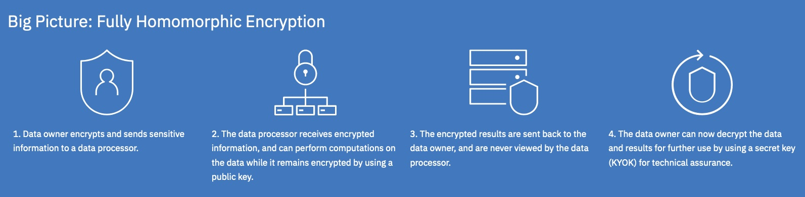

# Python helayers Tutorials

## Introduction

This demo consists of jupyter notebooks showcasing different aspects of Fully Homomorphic Encryption (FHE) and other advanced cryptographic techniques, such as Multi Party Computation (MPC), and Zero Knowledge Proofs (ZKP).
(The MPC and ZKP demos currently run on x86 machines only)

 All these notebooks present a guided interactive experience to the users and you are encouraged to run these notebooks and try out different use cases. **Switch to the Table of
Contents view to get the best viewing experience for the notebook.**

## Getting started

See table of contents and additional information here:

[`00_Getting_started.ipynb`] - Fully Homomorphic Encryption demos (FHE).
[`MPC_and_ZKP/00_GettingStarted.ipynb`] - Multi Party Computation (MPC) and Zero knowledge proofs (ZKP) demos (currently supported for x86 machines only).
[`tile_tensors/01_CTileTensor_basics.ipynb`] - A series of notebooks introducing the basics of using packing agnostic programming with HELayers using tile tensors. 

The FHE demos use three backends: SEAL, HELib, and HEaaN. For most demos it is easy to switch between different backends, and explore which works best in each case.

## How to Use

If you are unfamiliar with Jupyter notebooks, they are self-contained python applications that create a web-based development environment in the browser.  They integrate code, text, formatting, and output into a single document that can be run in inidividual steps or all together in sequence.

Each file that ends in `.ipynb` is considered one notebook.  From the menu on the left, choose a notebook to open by double clicking one.  Each notebook consists of different groups of code that are organized into cells.  A cell can be run by highlighting it, and then clicking the `Run` button, which is notated by the Play icon.  Or, you can run the whole notebook, choose `Run All Cells` from the `Run` menu at the top of the notebook.

Some of the notebooks use large data sets when running so they require more memory than what might be set by default.  Please allocate at least 8gb of memory in the Resources tab.  This can be found by navigating to `Docker -> Preferences -> Resources` .  A few demos require more memory, as noted in the beginning of their notebook.

More information about how to set resources can be found on the [docker website](https://docs.docker.com/config/containers/resource_constraints/).  Additionally, you can check out the user manual for windows [https://docs.docker.com/desktop/windows/](https://docs.docker.com/desktop/windows/), or mac [https://docs.docker.com/desktop/mac/](https://docs.docker.com/desktop/mac/) to learn how to allocate resources on the platform you are using.

[`00_Getting_started.ipynb`]: 00_Getting_started.ipynb
[`MPC_and_ZKP/00_GettingStarted.ipynb`]: MPC_and_ZKP/00_GettingStarted.ipynb
[`tile_tensors/01_CTileTensor_basics.ipynb`]: tile_tensors/01_CTileTensor_basics.ipynb

## License

See `documentation/license_agreement.pdf`
